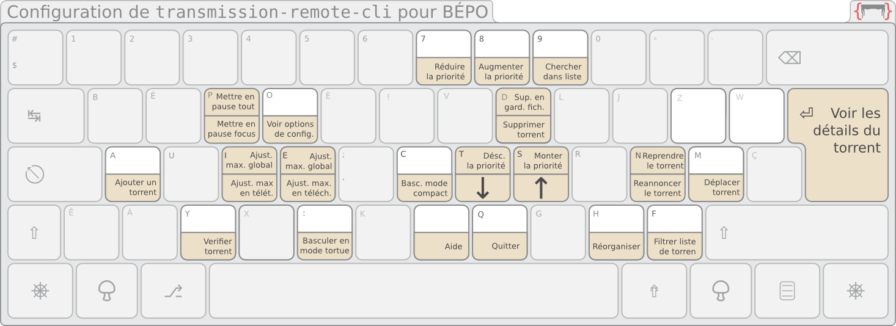

This is the adaptation for [BÉPO](http://bepo.fr) of the [`transmission-remote-cli`](https://github.com/FauveNoir/transmission-remote-cli).

Ceci est l’adaptation à [BÉPO](http://bepo.fr) de [`transmission-remote-cli`](https://github.com/FauveNoir/transmission-remote-cli).

## Usage

## Screenshots

## Copyright

Released under the GPLv3 license, see [COPYING](COPYING) for details.

## Contact

Pour l’auteur original de `transmission-remote-cli`, contactez [fagga](http://github.com/fagga).

Pour les aspects ayant strictement trait à l’adaptation à BÉPO, contactez [Fauve](https://github.com/FauveNoir).
